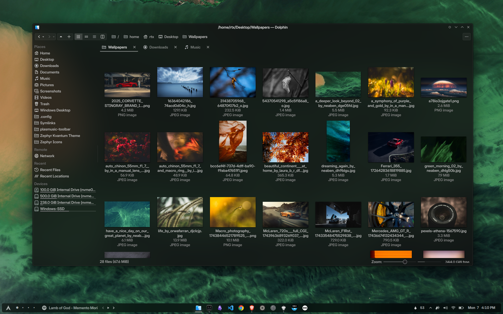
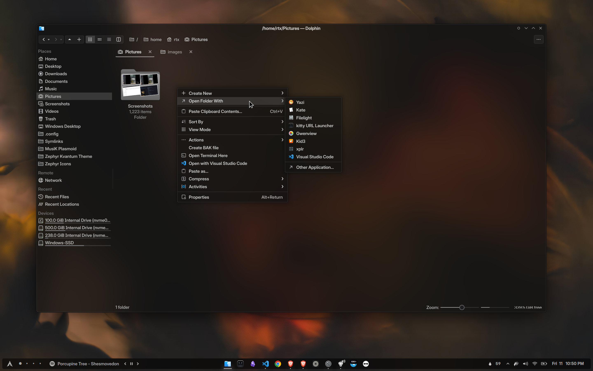
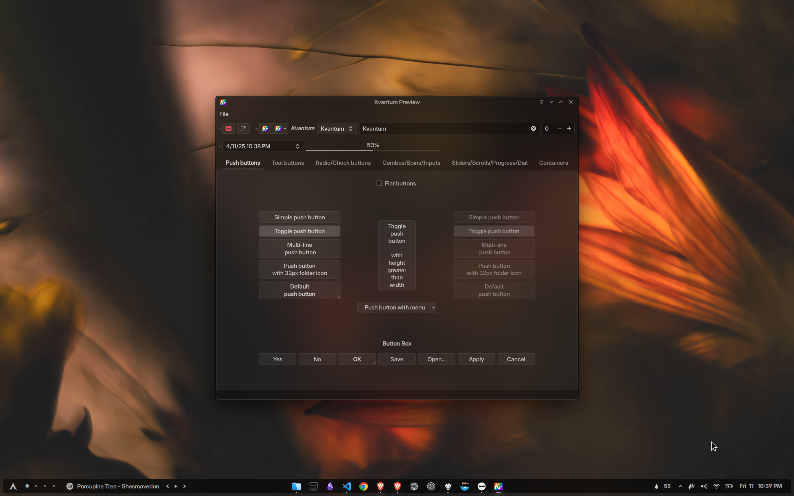
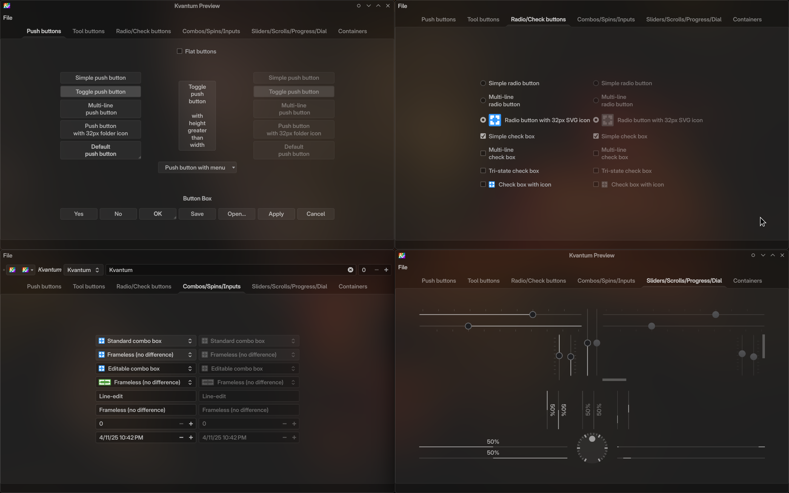

A dark Kvantum theme, originally designed to complement my [Zephyr](https://github.com/Rudraksh88/zephyr) Window Decoration theme.

Thoughtfully crafted with a refined monochrome palette, it brings a subtle touch of luxury and elegance to your desktop.

Tailored to pair seamlessly with [Zephyr Icons](https://github.com/Rudraksh88/zephyr-icons), this theme is perfect for Dark Mode enthusiasts. It features translucent elements that softly blend with the background, adding just the right hint of color for a sleek, modern aesthetic.

> [!NOTE]
> Zephyr decoration theme (based on KDecoration2) is archived due to new KDecoration3 API that introduced breaking changes. Instead, use this with my fork of Sierra Breeze Enhanced, which has the same style baked in.

# Screenshots






> [!TIP]
> * **Window Decoration:** Personal fork of Sierra Breeze Enhanced
> * **Icons:** [Zephyr Icons](https://github.com/Rudraksh88/zephyr-icons)
> * **UI Font:** Inter Display (Froze `'ss04', 'cv03', 'cv04', 'cpsp'` font features using FontFreeze)

# Installation
#### Requirements
- [Kvantum](https://github.com/tsujan/Kvantum/blob/master/Kvantum/INSTALL.md)

#### Steps
1. Clone the repo into `~/.config/Kvantum`
```bash
mkdir -p ~/.config/Kvantum
git clone https://github.com/Rudraksh88/zephyr-kvantum.git ~/.config/Kvantum/Zephyr
```

2. Set the theme using the Kvantum Manager:
   - Open **Kvantum Manager**.
   - In the **Kvantum Manager**, click on the **Change/Delete Theme** tab.
   - Choose **Zephyr** from the list of available themes.
   - Click **Apply** to set the theme.

You can alternatively just select the `Zephyr` folder (just clone it) right in the Kvantum Manager and it will install it for you.

Essentially, the Zephyr folder (containing the svg and kvconfig files) should be in `~/.config/Kvantum/` directory. Do that however you like LOL.

# Credits
I want to acknowledge the following individuals and projects that influenced this work:

* [tsujan](https://github.com/tsujan) for creating Kvantum, the SVG-based theme engine for Qt
* [Patrik Wyde](https://github.com/pwyde) for creating [Monochrome-KDE](https://github.com/pwyde/monochrome-kde), which served as initial inspiration

### Project Evolution
I initially started by modifying and tweaking [Patrik Wyde](https://github.com/pwyde)'s [Monochrome-KDE](https://github.com/pwyde/monochrome-kde) theme. As I continued to make changes, the project evolved significantly, becoming a distinct theme in its own right. This transformation led me to release it as a separate project.
While this theme has grown into its own unique work, I want to express my gratitude to these open-source contributors. Their efforts provided the foundation that allowed me to create this new theme.

# License
**Zephyr Kvantum Theme**
**Copyright (C) 2025 Rudraksh Tripathi**

This program is free software: you can redistribute it and/or modify it under the terms of the GNU General Public License as published by the Free Software Foundation, version 3.

See the [**LICENSE**](LICENSE) file for the complete license text.
