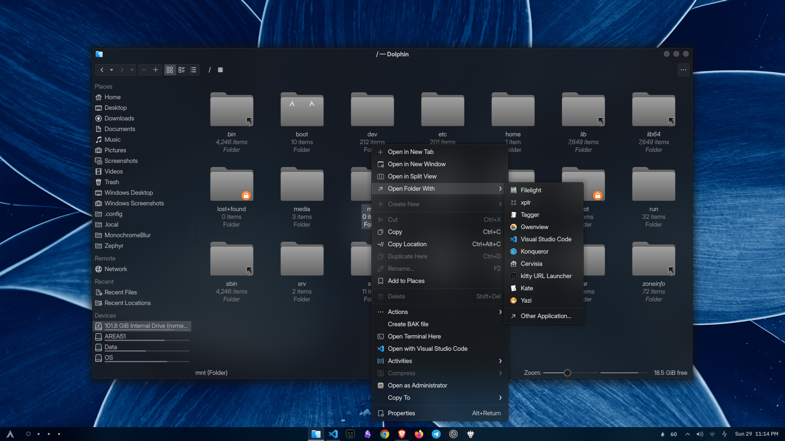
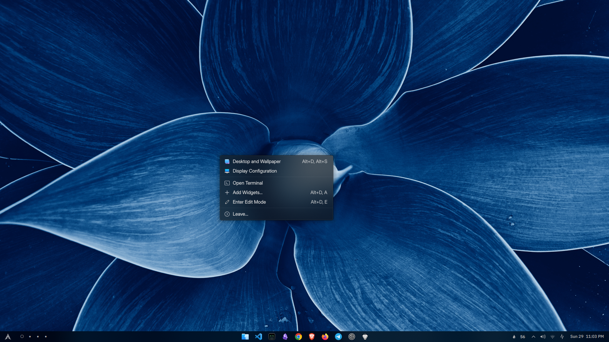
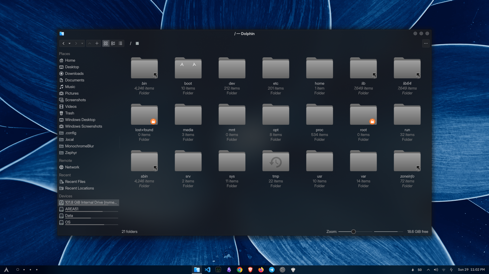

# Zephyr Kvantum theme
Kvantum theme to go with my [Zephyr](https://github.com/Rudraksh88/zephyr) window decoration theme.

Meticulously crafted to add a touch of luxury and elegance with its refined monochromatic palette.

# Installation
#### Requirements
- [Kvantum](https://github.com/tsujan/Kvantum/blob/master/Kvantum/INSTALL.md)

#### Steps
1. Download the repository as a zip file and extract it.
2. Open Kvantum Manager and select the extracted folder.
3. Select and use the theme from the list.

# Screenshots

> [!TIP]
> * Wallpaper: [https://wallhaven.cc/w/72wome](https://wallhaven.cc/w/72wome)
> * Window Decoration: Personal fork of Sierra Breeze Enhanced  
> * Icons: Personal fork of WhiteSur-Dark  

# Credits
I want to acknowledge the following individuals and projects that influenced this work:

* [tsujan](https://github.com/tsujan) for creating Kvantum, the SVG-based theme engine for Qt
* [Patrik Wyde](https://github.com/pwyde) for creating [Monochrome-KDE](https://github.com/pwyde/monochrome-kde), which served as initial inspiration

### Project Evolution
I initially started by modifying and tweaking [Patrik Wyde](https://github.com/pwyde)'s [Monochrome-KDE](https://github.com/pwyde/monochrome-kde) theme. As I continued to make changes, the project evolved significantly, becoming a distinct theme in its own right. This transformation led me to release it as a separate project.
While this theme has grown into its own unique work, I want to express my gratitude to these open-source contributors. Their efforts provided the foundation that allowed me to create this new theme.

# License
This project is licensed under the GNU General Public License v3.0. See the [LICENSE](LICENSE) file for more information.
